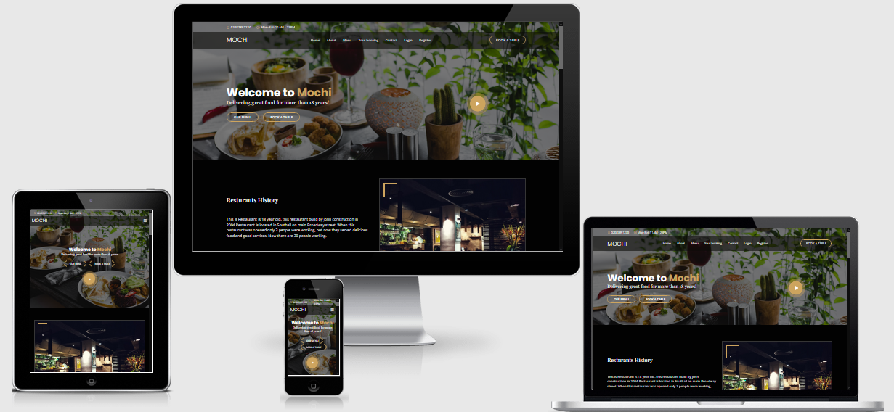
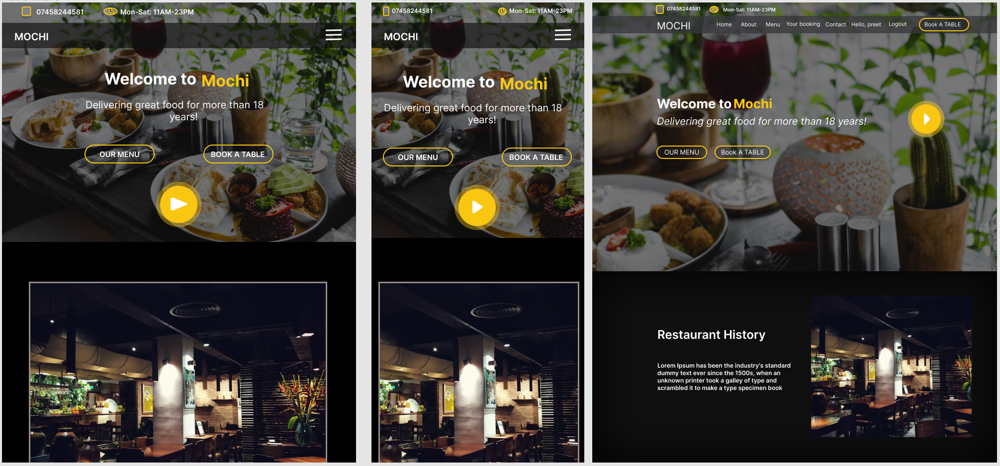
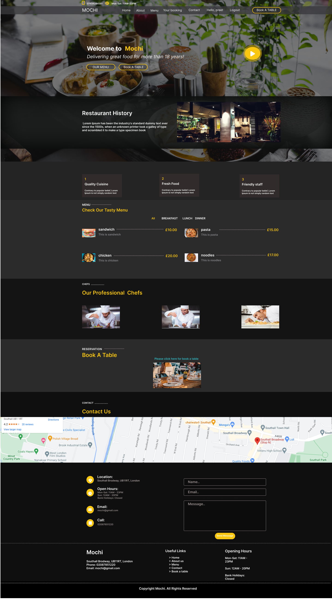
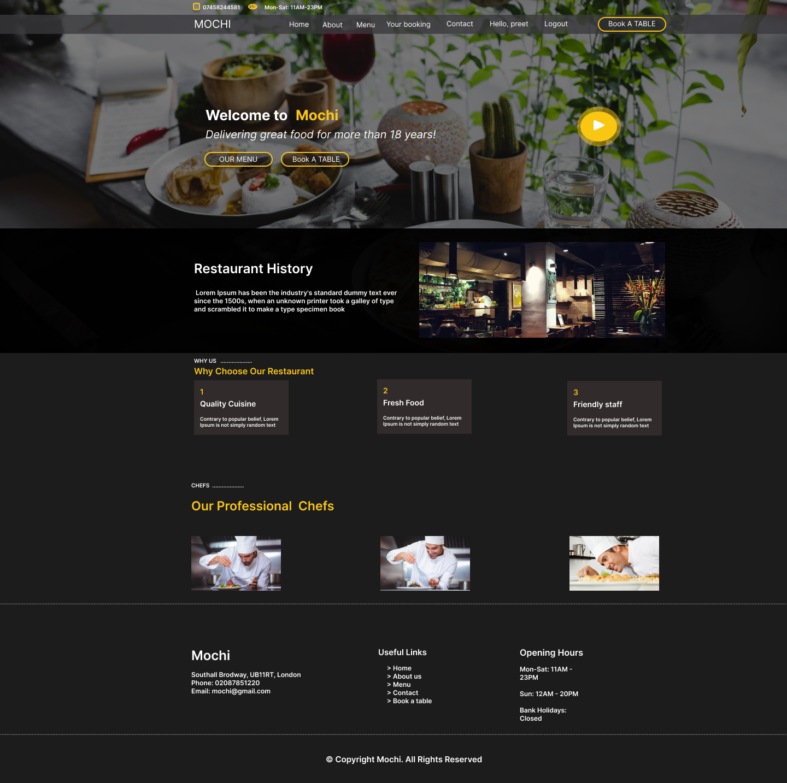
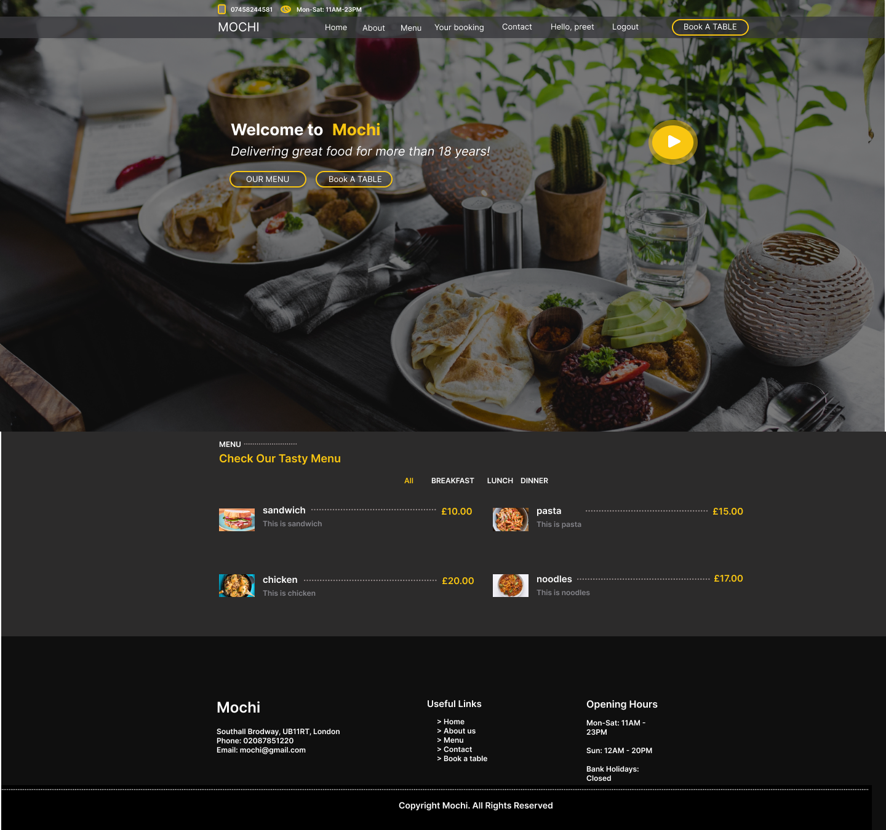
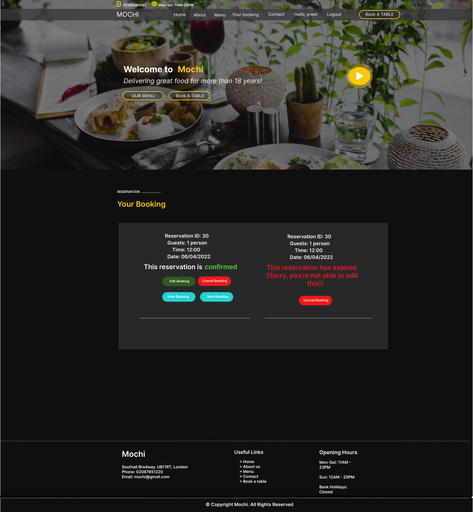
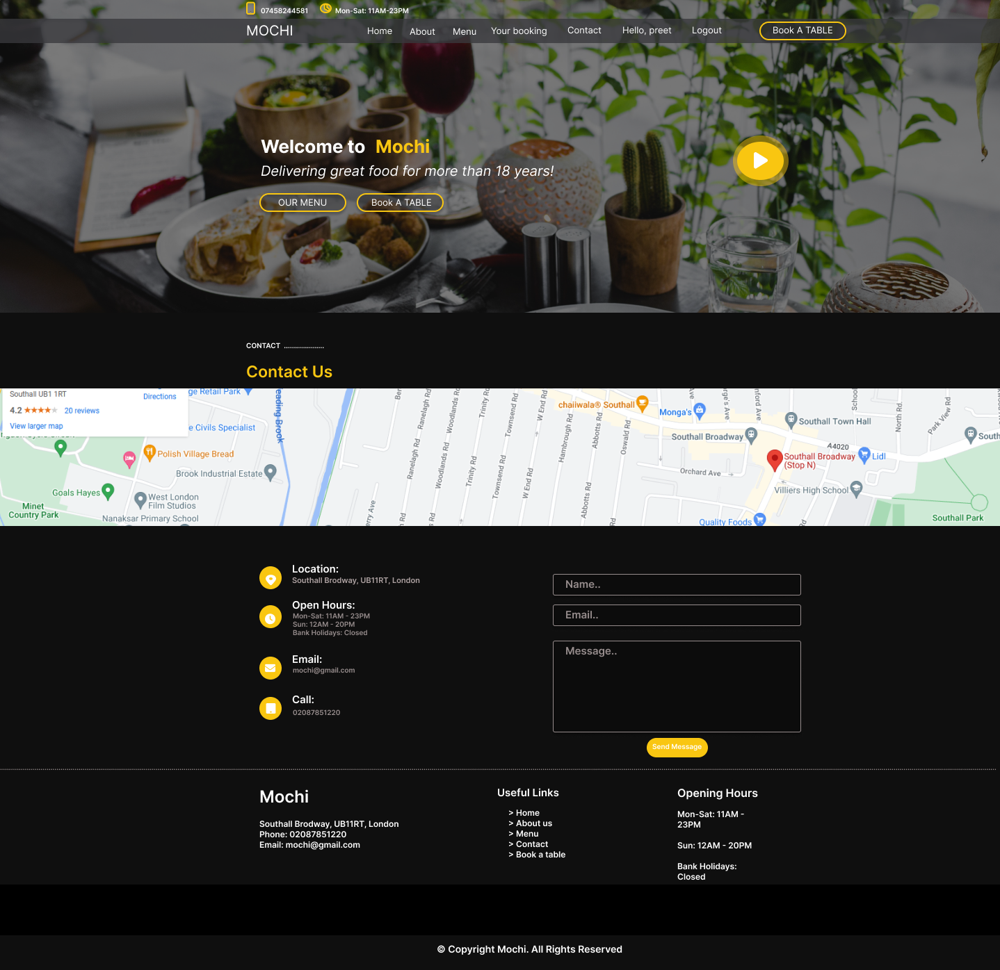
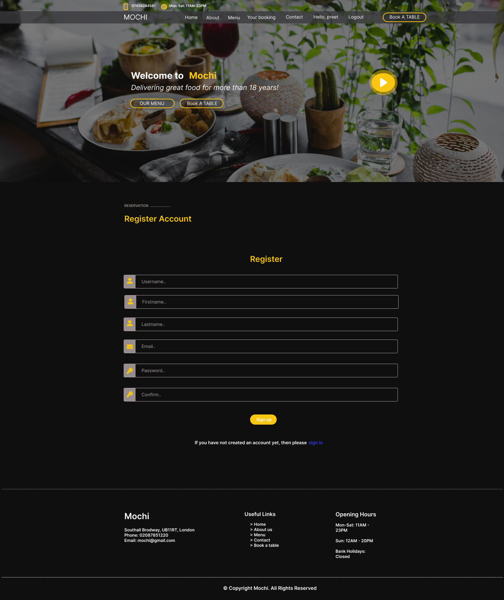
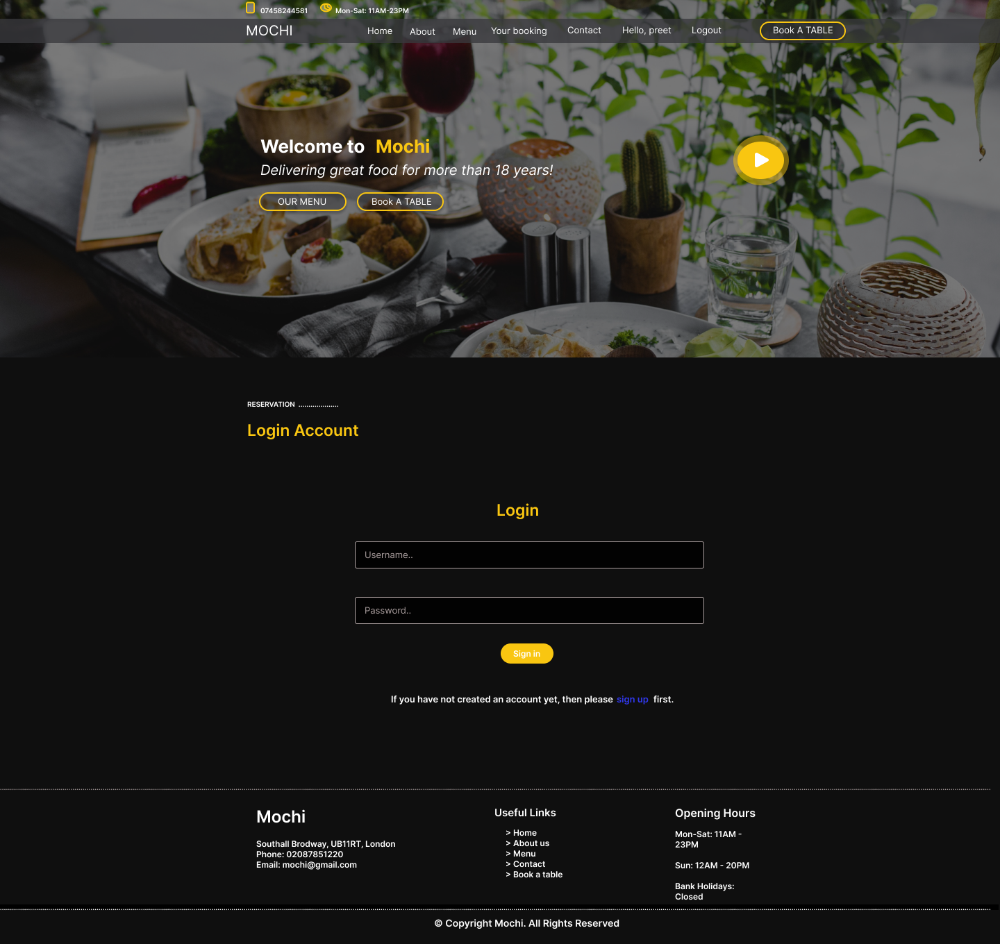
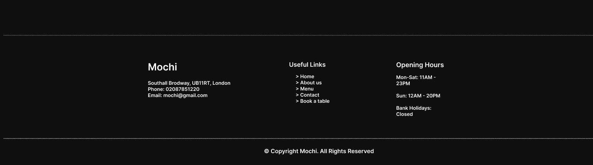

# Mochi Restaurant

[View the live project here](https://mochi-restaurant.herokuapp.com)

## Contents
1. [Introduction](#Introduction)

2. [User Experience](#User-Experience)

3. [Target](#Target)

4. [Design](#Design)

5. [Features](#Features)

6. [Bugs](#Bugs)

7. [Other Features](#Other-Features)

8. [Features Left to Implement](#Feature-Left-to-Implement)

9. [Technologies Used](#Technologies-Used)

10. [Frameworks Libraries and Programs Used](#Frameworks-Libraries-and-Programs-Used)

11. [Testing](#Testing)

    - [Testings.md](assets/test-file/testings.md)

12. [Deployment](#Deployment)

13. [Make a clone](#Make-a-clone)

14. [Credit](#Credit)

15. [Acknowledgements](#Acknowledgements)

## Introduction

This is my 4th project at code institute. This project is a restaurant website designed to advertise the restaurant and to allow the customer to make and manage any bookings. On this website, customers need to login or register on the website, where they can manage their booking, by logging on they can view, delete and change their bookings. If the customer does not login or register, they will only see a login option on the booking page. This website is deployed on Heroku.

[Go Top](#Mochi-Restaurant)

## User Experience

### Ideal User Demographic
* New users.
* Current users.

### User Stories

#### New users :

* For new/potential users, I have included all the information about the restaurant on one page.
* As an admin user, I can login to the website to access the site's backend.
* As an admin user, I can update, delete and accept or reject the reservations.
* As a new/potential user, I can login or register on the website to view or edit my bookings.
* As a new/potential user, I can see the Breakfast, Lunch and Dinner menu separately.

#### Current Users :
- As a current user, I can login to my account.
- As a current user, I can Edit, View and Cancel my bookings.
- As a current user, I can check my previous booking status.
- As a current user, I can contact the restaurant regarding my current booking information.
- As a current user, I can see all the new updates about the menu.

[Go Top](#Mochi-Restaurant)

## Target

- On the website home page, I have added a large background image about the food served in the restaurant, this image would persuade customers to visit the restaurant.
- On the website home page, I have added a video clip about the restaurant’s service and food, so that people can see everything about the restaurant before booking a table.

#### Structure
In this website I have used five apps:

1.  About us - restaurant history, chefs
2.	Menu - menu display
3.	Reservation - reservations enquiries & customer management
4.	Home - Information about all the pages
5.	Contact - user feedback

### Databases

The menu, about us and reservation apps require databases to store information, so I have built 8 custom models.

#### Menu
In the menu app I created two models named Meals & Category, these are two models that provide all the information required to display the items as a part of the restaurant's menu. Each item has a name, description, price, and information on how many people the dish serves.

This model is following this flow diagram:

#### Reservation
There are 3 models in the reservation app, Customer, Table & Reservation. These 3 models allow for the customer details to be stored, reservation enquiries to be made, managed & also enable availability checks whilst the user is enquiring.

For each reservation, there will be a customer & table assigned to it. The customer is assigned during the enquiry process and the tables are managed in the backend by the admin user. This model only works if the user is logged-in or registered. Logged-in users will have their details linked with the user email address as this is how they are located in the customer model.

The tables model is used for checking the availability of the tables in the restaurant. This process is used by the backend admin user, who checks if there is an available table in the restaurant then he can accept the user’s table request according to the availability.

This model is following this flow diagram:

[Go Top](#Mochi-Restaurant)

#### Aboutus
There are 3 models in the about us app, About Us, Why_Choose_Us and Chef. The About Us model is used to display the history of the restaurant with an image. Why_Choose_Us model is created to show the 3 blocks, one is to read about our staff, the Second is about fresh food and the last one is to read about our food quality. The chef model is used to show the information about our chef with a chef’s image, name and social accounts.

This model is following this flow diagram:

## Design

### Colour Schema
* I used four colours for the background and content, which are white, yellow, black and dark grey. I have also used a small amount of red for the cancel the booking button.
* I chose all the colours I used from the [theme waGon](https://themewagon.com/theme-tag/restaurant-template/) website.

#### Typography
* I selected the font I used from the [Google font](https://fonts.google.com/) website and linked it with my Css file.
* I used three font styles system-ui,-apple-system,"Segoe UI",Roboto,"Helvetica Neue",Arial,"Noto Sans","Liberation Sans",sans-serif.
* I have used the font Sans-serif for backup in instances where if the correct link isn’t provided to the css3 file, a font type is still available. If this occurs and the Google font does not work the backup font sans-serif will always work.

#### Imagery
* The background image used in this website plays a vital role in the user’s experience of the website.
* The image shown on the website has been selected to convince the customer to come to the restaurant.
* The Image is downloaded free from the [pexels](https://www.pexels.com/search/gym%20and%20fitness/) website.

#### Skeleton
- I used [Figma](https://www.figma.com/file/jCwcpxiv4ugqY8XK812AA8/Restaurant?node-id=0%3A1) Wireframe for the website.

[Go Top](#Mochi-Restaurant)

## Features

* ### Header
* ### Home Page
* ### About Page
* ### Menu Page
* ### Your Booking Page
* ### Contact Page
* ### Register Page
* ### Login Page
* ### Footer

### Header
In the header the main logo of the website is on the left-hand side, and the navigation links are on the right-hand side on all the pages. On medium-sized devices such as tablets, the logo stays on the left-hand side, but the navigation links hide behind the hamburger logo.

### Tablet Mobile And Desktop

### Home Page
The home page has a big hero image in the back. On the image I have added two buttons, one button is linked to the menu and the other one is linked to the booking a table page. Under the hero image, there is a section where there is a history of the restaurant with an image. Under the history section, there is a menu section about all the foods. Under the menu section, there is a form section for Email, Phone number, Address, restaurant Email and a link bar where the user can navigate to all the pages. A google map of the restaurant location is also featured on the home page.

### About Page
The about page also has a large background image. Under the image there is a small section about the history of the restaurant with a small image. Under the history section, I added a section about why the customer should choose our restaurant, in this section, there are three blocks, one block is about Quality Cuisine, the other one is about Fresh Food, and the last one is about our Friendly staff. At the bottom of the page, there is a section dedicated to our professional chefs. In this section, there are also three blocks, each block has a chef image with their name and their social media accounts.

[Go Top](#Mochi-Restaurant)

### Menu Page
The menu page has 3 sections for Breakfast, Lunch and Dinner. In this menu customers can see all the details about any dish along with its price.

### Your Booking Page
In the booking page there is a section about your booking. First you have to login or register your name because without logging in the user can't see their booking. After logging in the users can see their bookings if they have previously requested a booking in the past, users can also View, Edit, and Cancel their bookings on this page. If the user has not requested a booking before then this page will take them to the book a table page.

### Contact Page
The contact page has a background image and under this image there is a large map where users can see the location of the restaurant. Under the map there is a contact us section, in this section, users can see the restaurant’s email, phone number and opening hours. On the right-hand side of this section, there is a form for contacting the restaurant where users can send an email and their feedback.

### Register Page
On the register for an account page there is a form section which the user can complete to get an account. Under this form, I have provided a link for signing in if the user already has an account. This form is validated, if the user doesn’t add a valid email or name then the user will see an error message on top of the form.

### Login Page
On the login page, there is a section for the user to login. If user has already registered, then they can login to their account but if the user doesn't have an account, then I provided a link for them to register. When user logs in or registers then they can see their name on the top of the navbar.

[Go Top](#Mochi-Restaurant)

### Footer
A footer is featured on the bottom of every page of the website. The footer has all the detail about the restaurant, In the middle of the footer, there are links to all the pages of the website. On the right-hand side, details about the restaurant opening hours are listed.

## Bugs
* One bug present is when users send the contact form the following error occurs (Network is unreachable) with SMTP. It is working with the (backend console). I have tried to find out the solution on slack, StackOverflow and on google but I have been unable to find a solution.

## Issue Left
* Error when submitting the contact, us form with SMTP.

[Go Top](#Mochi-Restaurant)

## Other Features
* The logo is linked to the home page when the user clicks on the logo it will take them to the home page.
* On the form page, the navigation bar and email have a hover option. When the user hovers their mouse over the navigation bar it will highlight to a different colour. This makes it easier to understand for the user that this is a clickable link.

### Feature Left to Implement

* Customer can pay their bill online through the website with a debit card, credit card or PayPal. The reason why I didn't implement this is that I need to use third-party libraries for this, but this project only uses reservations.

## Technologies Used

### Languages Used
* [HTML5](https://en.wikipedia.org/wiki/HTML5)
* [CSS3](https://en.wikipedia.org/wiki/CSS)
* [Python](https://en.wikipedia.org/wiki/Python_(programming_language))
* [Javascript](https://en.wikipedia.org/wiki/JavaScript)
* [Jquery](https://en.wikipedia.org/wiki/JQuery)

### Frameworks Libraries and Programs Used

* [Django](https://www.djangoproject.com/)
  * Django is the framework that has been used to build the over project and its apps.

* [Bootstrap](https://getbootstrap.com/)
  * Used for creating responsive design.

* [Font Awesome](https://fontawesome.com/ "Link to FontAwesome")
  * Font awesome was used to import all the icons on the website.

* [Google Fonts](https://fonts.google.com/ "Link to Google Fonts")
  * Google fonts was used to import the google style fonts in css for example Lato, Oswald and sans-serif.

* [Git](https://git-scm.com/ "Link to Git homepage")
  * Gitpod was used for writing the code in the terminal it was also used to commit and push the code in GitHub.

* [GitHub](https://github.com/ "Link to GitHub")
  * GitHub was used to store the data which was pushed by Gitpod.

* [Gitpod](https://www.gitpod.io/)
    * Used as the development environment.
* [Heroku](https://dashboard.heroku.com/apps)
    * Used to deploy my application.

* [Figma](https://www.figma.com/ "Link to Figma homepage")
  * Figma was used to create the wireframe of the project before starting code on the terminal.

* [Cloudinary](https://cloudinary.com/)
    * Used to store all of my static files and images.

* [Favicon.io](https://favicon.io/)
    * Used to create favicon's for my website

* [Am I Responsive?](http://ami.responsivedesign.is/# "Link to Am I Responsive Homepage")
  * Am I Responsive was used to see if project is responsive on different types of devices.

- [W3C Markup Validation Service](https://validator.w3.org/)
    - Used to validate all HTML code written and used in this webpage.
* [W3C CSS Validation Service](https://jigsaw.w3.org/css-validator/#validate_by_input)
    * Used to validate all CSS code written and used in this webpage.
* [JSHint](https://jshint.com/)
    * Used to validate JS code.

* [SQLite](https://www.sqlite.org/index.html)
    * I have SQLite to run my database tests locally.

* [PostgreSQL](https://www.postgresql.org/)
    * I have used Heroku's PostgreSQL relational database in deployment to store the data for my models.

[Go Top](#Mochi-Restaurant)

## Testing
The testing process can be found  [here](assets/testing-file/testing.md)

## Deployment

### Github Pages
To deploy a Django application, The following options were used:
1. Click the `Use This Template` button.
2. Add a repository name and description.
3. Click the `Create Repository from Template` to create your repository.
4. To create a Gitpod workspace you then need to click `Gitpod`, this can take a few minutes.
5. When you want to open your project you can go in github and click on your repository then click on gitpod, or you can open with gitpod workspace as well.
6. when you change or write down new things you have to commit your work in github, use the following commands to make your commits:
   * `git add .`: adds all modified files to a staging area
    * `git commit -m "A message explaining your commit"`: commits all changes to a local repository.
    * `git push`: pushes all your committed changes to your Github repository.

### Heroku Pages
This site was deploy via Heroku.

This project was developed using a template provide by code institute however the template was upgraded to improve its functionality, which you can see in the commit.

To deploy this project on Heroku I used followed these steps:

1. [Login](https://dashboard.heroku.com/apps) into Heroku.

2. In the main Heroku dashboard select ‘New’in the top right corner.

3. In the drop down, menu select ‘Create New App’.

4. Give a name related your project. I gave hangman-games to my project.

5. When you see green text with your project name then press ‘create app’button.

6. From the dashboard select ‘setting’option.

7. After select setting option scroll down in the config setting. Select the config vars section This will display the current config vars for the app, there should be nothing already there.

8. After config var select Buildpacks option which is located under the config vars option.

9. In the buildpacks select python pack first save it then repeat select nodejs pack and save it.

10. After this scroll up and select ‘Deploy’ option.

11. In the ‘deploy’ option select ‘GitHub’ option to select your project which one you want to deploy on Heroku, choose your project and connect to the Heroku.

12. After connecting your project to Heroku scroll down on Automatic Deploys button.

13. This will ensure whenever you change something in the repo and push the changes to GitHub, Heroku will rebuild the app. If you select this manually you can manually deploy options further down. For this project, I did Automatic Deployment to enable me to check changes I made to the app as I developed it.

14. Heroku will now build the app for you. Once it has completed the build process you will see a 'Your App Was Successfully Deployed' message and a link to the app to visit the live site.

[Go Top](#Mochi-Restaurant)

### Make a Clone

1. [Login](https://github.com/)

2.	Click on Your Repository option and select your project

3.	Click on the code dropdown menu.

4.	To clone the repository using HTTPS, click "Clone with HTTPS", and copy the link.

5.	In your local IDE open the Git Bash terminal.

6.	Change the current working directory to the location where you want the cloned directory to be made.

7.	Type git clone, and then paste the URL you copied in Step 3.

           git clone https://github.com/USERNAME/REPOSITORY

8.	Press Enter. Your local clone will be created.

### Forking a Repository
1.	[Login](https://github.com/) into GitHub.

2.	On the top right, click the fork button.

3.	You will get a copy of the repository in your GitHub account.

## Credit

### Content
* All content Ideas were taken from researching restaurant using Wikipedia.

### Food Menu
* Food images,heading and description were taken from [wasabi](https://www.wasabi.uk.com/) and [Mochi Sushi ](https://www.mochisushitx.com/)

### Code

* [Django models](https://www.youtube.com/watch?v=EI02wQ51GjA&list=PLBTOBXTz1YFZK0moSgoZq93V_AdvrUGSj)
* [Testing](https://www.youtube.com/watch?v=0MrgsYswT1c)
* [Coverage](https://coverage.readthedocs.io/en/6.2/)
* [Gmail SMTP](https://www.youtube.com/watch?v=TZL-WFzvDJg)
* [View Booking](https://www.youtube.com/watch?v=EX6Tt-ZW0so&t=18s)
* [Update Booking](https://www.youtube.com/watch?v=EX6Tt-ZW0so&t=18s)
* [Cancel Booking](https://www.youtube.com/watch?v=EX6Tt-ZW0so&t=18s)
* [Access only login user](https://stackoverflow.com/questions/63602116/django-show-the-content-of-the-model-as-per-the-current-user-logged-in)
* [Login Form](https://www.youtube.com/watch?v=tUqUdu0Sjyc&t=990s)
* [Register Form](https://www.youtube.com/watch?v=tUqUdu0Sjyc&t=990s)
* [Compare date with booking date](https://stackoverflow.com/questions/67896192/comparing-dates-in-django)

### Media
* Some images download free from [pexels](https://www.pexels.com/search/gym%20and%20fitness/).

* The website template i downloaded free from [theme waGon](https://themewagon.com/theme-tag/restaurant-template/) website

## Acknowledgements
* I would especially like to thank my wife, who helped me by giving me some ideas regarding my website. She motivated me to finish this project to the best of my ability.
* Lastly I would like to thank my mentor Precious ljege, who helped during the whole process of the project.

[Go Top](#Mochi-Restaurant)